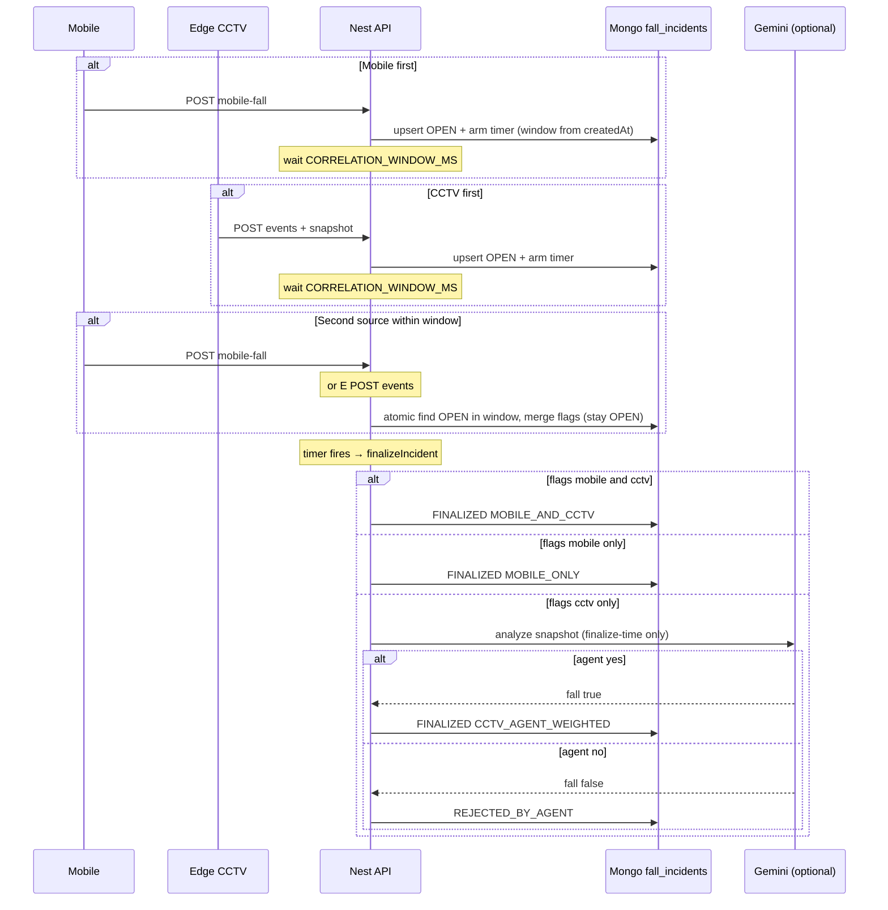

# Fally Backend (NestJS)

REST API and static dashboard for fall events from edge CCTV devices. Stack: **NestJS 10**, **MongoDB** (Mongoose), **class-validator**, **multer** (memory storage, files written under `SNAPSHOT_DIR`), **@nestjs/serve-static** for the UI at `/`.

## Requirements

- **Node.js ≥ 20** (Nest 10 and tooling assume a current LTS-style runtime).
- **MongoDB** reachable at the URI you configure (default `mongodb://localhost:27017/fally`).
- **pnpm** (preferred) or npm.

## Install

From this directory:

```bash
pnpm install
```

If you do not use pnpm:

```bash
npm install
```

## Configuration

Copy the example env file and adjust paths or secrets as needed:

```bash
cp .env.example .env
```

| Variable            | Description                                      |
| ------------------- | ------------------------------------------------ |
| `MONGODB_URI`       | Mongo connection string (not hardcoded in code). |
| `SNAPSHOT_DIR`      | Directory for uploaded JPEG snapshots.           |
| `EDGE_SHARED_TOKEN` | Shared secret; edge clients send `X-Edge-Token`. |
| `PORT`              | HTTP port (default `3000`).                      |

### Fall incidents (orchestration)

The backend correlates **mobile** fall reports and **CCTV** edge uploads into `fall_incidents` (Mongo) while continuing to write raw rows to `fall_events` for the existing dashboard.

| Variable                 | Description |
| ------------------------ | ----------- |
| `INCIDENT_SCOPE_ID`    | Default scope when clients omit `scopeId` (MVP single-scope). |
| `DEFAULT_CAMERA_ID`    | Reserved for clients mapping camera to scope (Edge); not required by Nest logic today. |
| `CORRELATION_WINDOW_MS`| Time window for **deferred finalization**: each incident waits this long before notifying so a second source can correlate (default `10000`). |
| `GEMINI_API_KEY`       | Google AI key for CCTV-only vision review; if empty, the agent returns “no fall” and logs a warning so dev servers still boot. |
| `GEMINI_MODEL`         | Model id (default `gemini-2.0-flash`). |
| `GEMINI_TIMEOUT_MS`    | Abort timeout for Gemini calls (default `8000`). |
| `CCTV_WEIGHT` / `AGENT_WEIGHT` | Weights for `weightedScore` on `CCTV_AGENT_WEIGHTED` outcomes (defaults `0.7` / `0.3`). |

**Mobile auth (MVP):** `POST /api/v1/incidents/mobile-fall` uses the same `X-Edge-Token` as Edge (`EDGE_SHARED_TOKEN`) so one secret can serve both clients for now. Plan to introduce a dedicated mobile token later.

**Privacy:** Sending CCTV snapshots to Google implies off-device processing; document policies accordingly for production.

**Phase 2:** A Python **LangGraph** worker could replace the in-process state machine while keeping the same REST surface and Mongo collections; this repo does not ship LangGraph yet.

#### Incident flow (MVP)

Each ingest (`POST /api/v1/incidents/mobile-fall` or CCTV via `POST /api/v1/events`) **opens or updates** a `fall_incidents` row in state **`OPEN`**. A single in-process `setTimeout` per incident fires **`CORRELATION_WINDOW_MS` after `createdAt`**, then `finalizeIncident` runs once:

- **Mobile + CCTV both set before finalize** → `FINALIZED` / `MOBILE_AND_CCTV`. **Gemini is not called**; `weightedScore` is not used.
- **Mobile only** → `FINALIZED` / `MOBILE_ONLY`.
- **CCTV only** → **Gemini runs only at finalize time** on the stored snapshot. Verdict `yes` → `FINALIZED` / `CCTV_AGENT_WEIGHTED` with `weightedScore = CCTV_WEIGHT * cctvConfidence + AGENT_WEIGHT * agentConfidence`. Verdict `no` → `REJECTED_BY_AGENT` (no `notifyType`).

Correlation for a second signal uses an atomic `findOneAndUpdate`: same `scopeId`, **`state: OPEN`**, and **`createdAt >= now - CORRELATION_WINDOW_MS`**. If nothing matches, a **new** `OPEN` incident is created and its own timer is armed. A **late** CCTV after a prior incident has already left `OPEN` therefore starts a **new** incident (it is not merged into an older finalized row).

**Ingest response (breaking vs earlier builds):** `mobile-fall` returns `201` with `{ id, state: "OPEN", expectedFinalizeAt }` (ISO time when finalize is scheduled). `notifyType` is unknown until finalize. The Flutter client currently treats the POST as fire-and-forget and does not depend on this body.

**Restart / crash recovery:** On startup, `IncidentsService` loads `OPEN` incidents: those older than the window are **finalized immediately**; those still inside the window get a **new timer** with the **remaining** delay so rows are not stranded in `OPEN`.

**Multi-instance limitation (MVP):** finalize timers live in **process memory**. With several Nest replicas, each process schedules its own timers; there is no cross-process deduplication. Single-instance deployments behave as designed; scale-out should move to a shared scheduler or worker later.



Runtime snapshot files live under `data/` (ignored by git); the repo ships `data/snapshots/.gitkeep` so the folder exists.

## Run

Development (watch mode):

```bash
pnpm run start:dev
```

Production build + run:

```bash
pnpm run build
pnpm run start:prod
```

- API base path: **`/api/v1`**
- Health: **`GET /healthz`** → `{ "status": "ok" }` (not under `/api/v1`)
- Dashboard: **`http://localhost:3000/`** (static UI; data loads via `fetch` on load, **Refresh**, or filter **Apply** only — no polling, no WebSocket)

## API summary

| Method | Path | Notes |
| ------ | ---- | ----- |
| `POST` | `/api/v1/events` | Multipart: file field `snapshot`, form field `payload` (JSON string). Header `X-Edge-Token` required. Returns `{ id, snapshotUrl }` (201). |
| `GET` | `/api/v1/events` | Query: `limit`, `page`, `cameraId`, `label`, `from`, `to`, `resolved`. |
| `GET` | `/api/v1/events/:id` | Event detail. |
| `PATCH` | `/api/v1/events/:id` | Body `{ "resolved": boolean }`. |
| `GET` | `/api/v1/snapshots/:eventId` | JPEG from disk. |
| `GET` | `/api/v1/cameras` | Per-camera aggregates: `lastSeen`, `eventsLast24h`, `fallsLast24h`. |
| `POST` | `/api/v1/incidents/mobile-fall` | JSON body: `detectedAt` (ISO8601 UTC), `confidence` (0–1), optional `deviceId`, optional `scopeId` (defaults to `INCIDENT_SCOPE_ID`). Header `X-Edge-Token` (same as Edge for MVP). Returns `201` `{ id, state: "OPEN", expectedFinalizeAt }` (finalize and `notifyType` are deferred until the correlation window elapses). |
| `GET` | `/api/v1/incidents` | Paginated list (`limit`, `page`), newest first. |
| `GET` | `/api/v1/incidents/:id` | Incident detail. |

The CCTV multipart `payload` JSON may include optional `scopeId`; if omitted, the backend uses `INCIDENT_SCOPE_ID`.

## Docker prep

Ports, Mongo URI, snapshot directory, and the edge token are all read from the environment via `@nestjs/config` — suitable for container overrides and volume mounts later without code changes.
