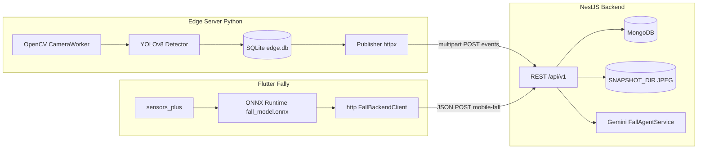

# Báo cáo đồ án: Hệ thống Fally — Phát hiện ngã đa nguồn (CCTV + thiết bị di động)

Tài liệu này mô tả toàn bộ mã nguồn và kiến trúc trong workspace **FallyProject**, phục vụ viết báo cáo đồ án. Nội dung bám sát cấu trúc thư mục, README kèm theo và mã nguồn thực tế tại thời điểm khảo sát.

---

## 1. Tổng quan

**Fally** là một hệ thống giám sát an toàn hướng tới **phát hiện sự kiện ngã (fall detection)** từ nhiều nguồn:

1. **Camera (CCTV / webcam tại biên — edge):** dùng mô hình **YOLOv8** (Ultralytics) phân loại khung hình thành các nhãn như *Fall Detected*, *Walking*, *Sitting*; khi phát hiện ngã, lưu ảnh chụp nhanh (snapshot), ghi SQLite cục bộ và **đồng bộ lên backend** qua HTTP.
2. **Ứng dụng di động (Flutter):** đọc **gia tốc kế và con quay hồi chuyển**, trích xuất đặc trưng thống kê trên cửa sổ thời gian, chạy suy luận **ONNX** trên thiết bị; khi nghi ngờ ngã, gửi báo cáo **JSON** tới backend (`mobile-fall`).
3. **Backend tập trung (NestJS + MongoDB):** nhận sự kiện thô từ CCTV và báo cáo từ mobile; **tương quan (correlate)** theo `scopeId` và cửa sổ thời gian; trong trường hợp chỉ có CCTV, có thể gọi **Google Gemini** để phân tích ảnh (tùy cấu hình API key).

Mục tiêu kiến trúc: **edge có thể hoạt động khi mất mạng ngắn** (SQLite + hàng đợi đồng bộ có retry), **trung tâm** tổng hợp, lưu trữ và (tùy chọn) **xác minh bằng mô hình ngôn ngữ-thị giác**.

---

## 2. Mục tiêu chức năng và phạm vi

| Mục tiêu | Mô tả trong repo |
|----------|------------------|
| Phát hiện ngã trên video | Edge Python: YOLOv8, trọng số mặc định trỏ tới `Resources/best.pt` |
| Huấn luyện / tái tạo pipeline | `Resources/fally_cctv.py`: script Colab — tải dataset Kaggle, cấu hình `data.yaml`, train YOLOv8n |
| Phát hiện ngã trên điện thoại | Flutter: cảm biến + ONNX `fall_model.onnx` |
| Lưu trữ và API | NestJS: collection `fall_events`, `fall_incidents`; file ảnh trên đĩa |
| Tương quan đa nguồn | `IncidentsService`: cửa sổ `CORRELATION_WINDOW_MS`, ghép mobile + CCTV |
| UI vận hành | Edge: FastAPI + MJPEG + trang `ui/index.html`; Backend: static dashboard tại `/` (thư mục `backend/public`) |

**Ngoài phạm vi hiện tại (theo comment trong mã / README):** hàng đợi retry phía mobile khi offline; worker LangGraph thay state machine; scale-out nhiều replica Nest với bộ hẹn giờ tập trung.

---

## 3. Kiến trúc tổng thể



**Luồng dữ liệu chính:**

- **CCTV:** Edge lưu hàng locally → `POST /api/v1/events` (file `snapshot` + form `payload` JSON) → lưu `fall_events` + kích hoạt `onCctvFall`.
- **Mobile:** App gửi `POST /api/v1/incidents/mobile-fall` → `onMobileFall`.
- **Health:** Backend expose `GET /healthz` (ở **gốc**, không nằm dưới prefix `/api/v1` — cấu hình trong `main.ts`).

---

## 4. Cấu trúc thư mục dự án

```
FallyProject/
├── Resources/           # Pipeline huấn luyện (Colab) + trọng số YOLO best.pt
├── edge_server/         # FastAPI, camera, SQLite, đồng bộ backend
├── backend/             # NestJS, MongoDB, dashboard static, Gemini tùy chọn
├── Fally/               # Flutter app (cảm biến + ONNX + báo cáo mobile-fall)
└── report.md            # Báo cáo này
```

---

## 5. Thành phần chi tiết

### 5.1. `Resources/` — Huấn luyện mô hình CCTV

- **`fally_cctv.py`:** Nội dung xuất phát từ notebook Colab: cài `ultralytics`, cấu hình Kaggle, tải dataset *Fall Detection* (Kaggle: `uttejkumarkandagatla/fall-detection-dataset`), sinh `data.yaml` với **3 lớp**: `Fall Detected`, `Walking`, `Sitting` (`nc: 3`).
- Huấn luyện: khởi tạo `YOLO('yolov8n.pt')`, gọi `.train(...)` với `epochs=50`, `imgsz=640`, `batch=16`, v.v.
- Suy luận video mẫu: `model.predict(..., conf=0.40, save=True)` — **ngưỡng 0.4** được edge và `.env.example` tham chiếu để đồng nhất hành vi.
- **`best.pt`:** file trọng số YOLO (binary), edge mặc định đọc qua `MODEL_PATH`.

### 5.2. `edge_server/` — Máy chủ biên (Python)

**Vai trò:** Đọc webcam (tùy thiết bị), chạy YOLO theo chu kỳ, vẽ bbox, phát MJPEG, lưu sự kiện local, đẩy lên backend.

**Công nghệ (theo `requirements.txt`):**

| Gói | Phiên bản (pin) | Vai trò |
|-----|------------------|---------|
| fastapi | 0.115.6 | HTTP API |
| uvicorn | 0.32.1 | ASGI server |
| ultralytics | 8.3.49 | YOLOv8 |
| opencv-python | 4.10.0.84 | Capture + JPEG |
| httpx | 0.28.1 | POST bất đồng bộ tới backend |
| aiosqlite | 0.20.0 | SQLite async |
| pydantic-settings | 2.6.1 | Đọc `.env` |

**Python:** README khuyến nghị **CPython 3.10–3.12** (wheel PyTorch/Ultralytics).

**Module chính:**

| File | Nhiệm vụ |
|------|----------|
| `app/config.py` | `Settings` (Pydantic): đường dẫn model, camera, ngưỡng, cooldown, `CAMERA_ID`, `BACKEND_URL`, token, `SCOPE_ID`, DB, snapshot dir, port, UI |
| `app/main.py` | Lifespan FastAPI: `init_db`, load YOLO, khởi `CameraWorker`, task `publisher_loop` |
| `app/db.py` | Schema bảng `local_events` (camera_id, label, confidence, bbox, detected_at, snapshot_path, synced, backend_event_id, …) |
| `app/events_repo.py` | CRUD/count cho SQLite |
| `app/detector.py` | `YoloFallDetector`: lazy load, `predict`, `annotate` (ngã màu đỏ BGR, khác màu xám) |
| `app/camera.py` | `CameraWorker` (thread): ~30 FPS, inference mỗi `INFERENCE_EVERY_N_FRAMES` frame; cooldown ngã `FALL_COOLDOWN_SECONDS`; lưu JPEG và gọi `persist_fall` qua `run_coroutine_threadsafe` |
| `app/publisher.py` | Lấy `local_id` từ queue; đọc row + file JPEG; `POST .../api/v1/events` multipart; tối đa 3 lần, backoff 2s; khi 201 cập nhật `synced` và `backend_event_id` |
| `app/routes.py` | `/`, `/video_feed` (MJPEG), `/api/status`, `/api/events`, `/api/snapshots/{id}`, `/api/test-event` |
| `ui/index.html` | Dashboard edge (Tailwind CDN, JS) |

**Hành vi đặc biệt:**

- Không mở được camera: vẫn chạy, MJPEG hiển thị placeholder; `camera_open: false`.
- Không load được model: bỏ qua suy luận; nút test vẫn kiểm SQLite + publisher.
- Publisher: header `X-Edge-Token` khớp `BACKEND_SHARED_TOKEN` phía Nest.

**Lưu ý triển khai:** Trong `routes.py`, kiểm tra `backend_reachable` gọi `GET {BACKEND_URL}/api/v1/healthz`, trong khi ứng dụng Nest cấu hình health tại **`GET /healthz`** (ngoài prefix `api/v1`). Khi viết báo cáo hoặc sửa mã, nên thống nhất một URL health để chỉ báo trạng thái chính xác.

### 5.3. `backend/` — API và dashboard (NestJS)

**Vai trò:** REST API phiên bản 1 dưới prefix **`/api/v1`**, health **`/healthz`**, phục vụ file tĩnh UI tại **`/`**.

**Yêu cầu:** Node **≥ 20**, MongoDB, **pnpm** (khuyến nghị).

**Phụ thuộc chính (`package.json`):** `@nestjs/common` ^10, `mongoose` ^8, `@google/generative-ai` ^0.21, `multer`, `class-validator`, `@nestjs/serve-static`.

**Module / tính năng:**

| Thành phần | Mô tả |
|------------|--------|
| `EventsModule` | CRUD/query `fall_events`, upload snapshot, tích hợp `IncidentsService.onCctvFall` sau khi tạo event |
| `IncidentsModule` | Tương quan `fall_incidents`, timer trong process |
| `FallAgentModule` | `FallAgentService`: đọc file JPEG, gửi Gemini (prompt JSON nghiêm ngặt), parse kết quả |
| `StorageModule` | Lưu buffer upload ra `SNAPSHOT_DIR` |
| `CamerasModule` | Tổng hợp theo camera (README: `lastSeen`, thống kê 24h) |
| `EdgeTokenGuard` | Xác thực header `X-Edge-Token` so với `EDGE_SHARED_TOKEN` |
| `HealthController` | `{ status: "ok" }` |
| `ServeStaticModule` | `backend/public` → `/` |

**Schema MongoDB:**

- **`fall_events`:** Sự kiện thô từ CCTV: `cameraId`, `label`, `confidence`, `bbox`, `detectedAt`, `snapshotFilename`, `resolved`.
- **`fall_incidents`:** Bản ghi “vụ việc” sau tương quan: `scopeId`, `state`, cờ `mobileDetected` / `cctvDetected`, confidence từng nguồn, `snapshotFilename`, `bbox`, `cameraId`, `deviceId`, `rawCctvEventId`, kết quả agent (`agentVerdict`, `agentRaw`, …), `weightedScore`, `notifyType`, `finalizedAt`.

**Máy trạng thái incidents (mã thực tế):**

- Khi ingest, hầu hết bản ghi mới ở trạng thái **`PENDING_CORRELATION`** (README cũ có đoạn mô tả `OPEN` — trong code đường đi chính dùng `PENDING_CORRELATION`).
- Sau **`CORRELATION_WINDOW_MS`** (mặc định 10000 ms):
  - Chỉ mobile → **`FINALIZED`** / `MOBILE_ONLY`.
  - Chỉ CCTV → chạy Gemini (nếu có key); `fall: true` → **`FINALIZED`** / `CCTV_AGENT_WEIGHTED` với `weightedScore = CCTV_WEIGHT * cctvConfidence + AGENT_WEIGHT * agentConfidence`; `fall: false` → **`REJECTED_BY_AGENT`**.
  - Trong cửa sổ, nếu đủ cả hai nguồn → **`FINALIZED`** / `MOBILE_AND_CCTV` (**không** gọi Gemini).

**Biến môi trường quan trọng (`.env.example`):**

- `MONGODB_URI`, `SNAPSHOT_DIR`, `EDGE_SHARED_TOKEN`, `PORT`
- `INCIDENT_SCOPE_ID`, `CORRELATION_WINDOW_MS`
- `GEMINI_API_KEY`, `GEMINI_MODEL`, `GEMINI_TIMEOUT_MS`, `CCTV_WEIGHT`, `AGENT_WEIGHT`

**Quyền riêng tư:** Gửi ảnh CCTV lên Google là xử lý ngoài thiết bị; production cần chính sách rõ ràng (README backend đã nhắc).

### 5.4. `Fally/` — Ứng dụng Flutter

**Tên package:** `fally_app` (`pubspec.yaml`).

**SDK:** Dart `^3.11.5`.

**Thư viện chính:**

- `sensors_plus`: luồng gia tốc kế / con quay.
- `onnxruntime`: nạp `fall_model.onnx` từ assets, suy luận trên CPU (cấu hình session cơ bản).
- `http`: POST `mobile-fall`.

**Cấu hình build-time:** `FallBackendConfig.fromEnvironment()` dùng `--dart-define`:

- `BACKEND_BASE_URL` — rỗng thì tắt báo cáo HTTP.
- `BACKEND_SHARED_TOKEN` (mặc định `devtoken`).
- `MOBILE_SCOPE_ID` (mặc định `default`) — phải khớp logic `scopeId` với edge/backend để tương quan.
- `MOBILE_FALL_COOLDOWN_SECONDS` (mặc định 5).

**Luồng màn hình (`fall_detection_screen.dart`):** Thu thập mẫu cảm biến, cửa sổ trượt (ví dụ `_windowSize`, `_windowStep`), gọi `FallInferenceService.predictFromWindow`, hiển thị xác suất; khi phát hiện ngã (xác suất ≥ 0.5) và qua cooldown, `FallBackendClient.reportMobileFall`.

**Đặc trưng ONNX:** Vector đầu vào **27 chiều** (thống kê trên 6 kênh acc/gyro — mean, std, min, max, energy, SMA, zero-crossing rate theo logic trong service).

**Hạn chế đã ghi trong mã:** Không có persistence/retry queue khi mất mạng (phase 2).

---

## 6. API tổng hợp (tham chiếu nhanh)

### Edge (cổng mặc định 8001)

| Phương thức | Đường dẫn | Mô tả |
|-------------|-----------|--------|
| GET | `/` | UI edge |
| GET | `/video_feed` | MJPEG |
| GET | `/api/status` | Trạng thái camera, FPS, model, unsynced, backend |
| GET | `/api/events` | Danh sách sự kiện local |
| GET | `/api/snapshots/{id}` | JPEG theo id |
| POST | `/api/test-event` | Tạo sự kiện thử (placeholder) |

### Backend (cổng mặc định 3000)

| Phương thức | Đường dẫn | Ghi chú |
|-------------|-----------|---------|
| GET | `/healthz` | Không prefix `api/v1` |
| POST | `/api/v1/events` | Multipart + `X-Edge-Token` |
| GET/PATCH | `/api/v1/events`, `/api/v1/events/:id` | Query, cập nhật `resolved` |
| GET | `/api/v1/snapshots/:eventId` | Trả file JPEG |
| GET | `/api/v1/cameras` | Thống kê camera |
| POST | `/api/v1/incidents/mobile-fall` | JSON + `X-Edge-Token` |
| GET | `/api/v1/incidents`, `/api/v1/incidents/:id` | Danh sách / chi tiết incident |

---

## 7. Cài đặt và chạy thử (tóm tắt)

1. **MongoDB** chạy local hoặc URI từ xa.
2. **Backend:** `cd backend && cp .env.example .env && pnpm install && pnpm run start:dev`.
3. **Edge:** `cd edge_server`, tạo venv Python 3.12, `pip install -r requirements.txt`, `cp .env.example .env`, chỉnh `BACKEND_URL` và token trùng backend, `uvicorn app.main:app --host 0.0.0.0 --port 8001`.
4. **Flutter:** `cd Fally`, cấu hình `dart-define` trỏ tới backend, `flutter run`.

Đảm bảo `EDGE_SHARED_TOKEN` (backend) = `BACKEND_SHARED_TOKEN` (edge) = `BACKEND_SHARED_TOKEN` / `X-Edge-Token` (mobile) trong môi trường dev.

---

## 8. Bảo mật (MVP)

- Xác thực edge/mobile hiện dùng **một shared secret** qua header; phù hợp lab, **không** thay thế OAuth/JWT đầy đủ cho production.
- Ảnh và metadata lưu trên đĩa server và Mongo — cần backup, kiểm soát truy cập OS/DB.

---

## 9. Kiểm thử trong repo

- Backend: Jest (`pnpm test`), có `incidents.service.spec.ts` và e2e (`test/app.e2e-spec.ts`).
- Flutter: `flutter_test`, `fall_backend_client_test.dart`.

---

## 10. Hạn chế và hướng phát triển (tổng hợp từ mã + README)

| Hạng mục | Chi tiết |
|----------|----------|
| Timer incidents | Trong bộ nhớ process — nhiều replica Nest có thể trùng lịch; cần scheduler chung hoặc worker |
| Mobile offline | Chưa có hàng đợi retry bền |
| Health URL edge vs Nest | Cần đồng bộ đường dẫn kiểm tra |
| Phase 2 | Worker LangGraph, token riêng cho mobile, orphan sweeper (TODO trong `IncidentsService`) |
| Độ trễ Gemini | Timeout cấu hình `GEMINI_TIMEOUT_MS`; khi không có key, agent trả “no” an toàn để server vẫn khởi động |

---

## 11. Kết luận (gợi ý đoạn kết báo cáo đồ án)

Dự án **FallyProject** triển khai một **pipeline phát hiện ngã đa tầng**: thị giác máy tính tại biên (YOLOv8), cảm biến trên thiết bị cầm tay (ONNX), và lớp **hợp nhất + (tùy chọn) xác minh bằng mô hình đa phương thức** tại backend. Kiến trúc tách **edge — cloud — mobile** giúp làm rõ vai trò từng thành phần trong đồ án: thu thập dữ liệu, huấn luyện mô hình, triển khai dịch vụ, API, và trải nghiệm người dùng trên di động.

---

*Tài liệu được tạo tự động từ mã nguồn và README trong workspace FallyProject.*
